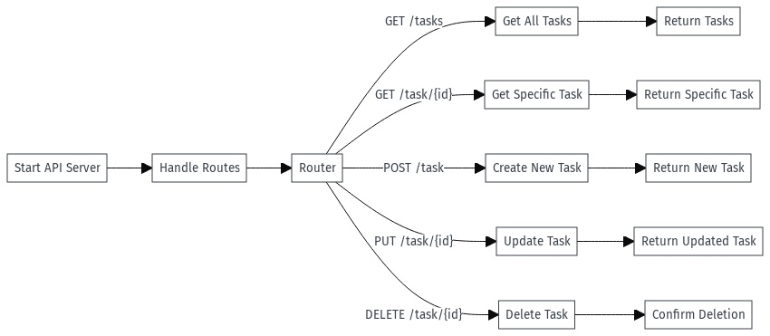

# Go Task Management API

## Project Overview
This Go project provides a RESTful API for task management. Utilizing the Gorilla Mux package for routing, it allows users to create, read, update, and delete tasks. Each task is structured with attributes like ID, Name, Description, and Due Date.

## Features
- **CRUD Operations**: Create, read, update, and delete tasks.
- **Initial Task Setup**: Pre-populates the system with an initial set of tasks.
- **Error Handling**: Properly handles errors and sends appropriate responses.

## Installation
To get this project up and running on your system, follow these steps:
1. Ensure you have Go installed.
2. Clone the repository.
3. Navigate to the project directory and run `go build` or `go run`.

## Usage
Once the application is running, you can interact with the API on `localhost:10000`. The following endpoints are available:
- `GET /tasks`: Retrieves all tasks.
- `GET /task/{id}`: Retrieves a specific task by ID.
- `POST /task`: Creates a new task.
- `PUT /task/{id}`: Updates an existing task.
- `DELETE /task/{id}`: Deletes a task.

## Contributing
Contributions to this project are welcome. Please ensure to update tests as appropriate.

## License
This project is licensed under the [MIT License](LICENSE).

## Contact
For questions or contributions, please submit an issue or fork this project.
